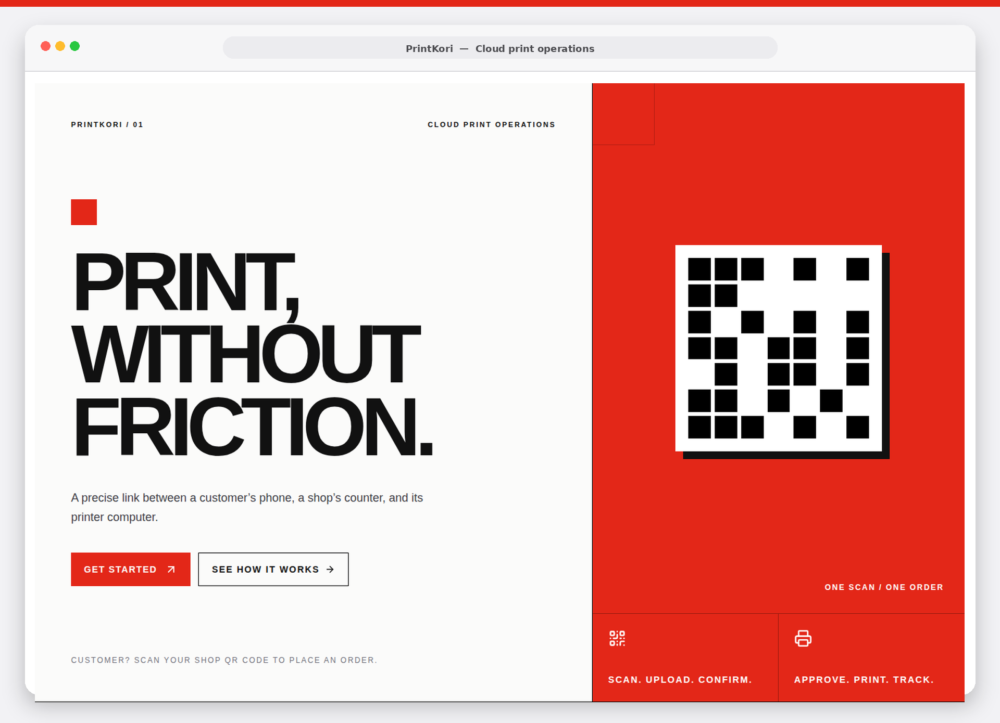
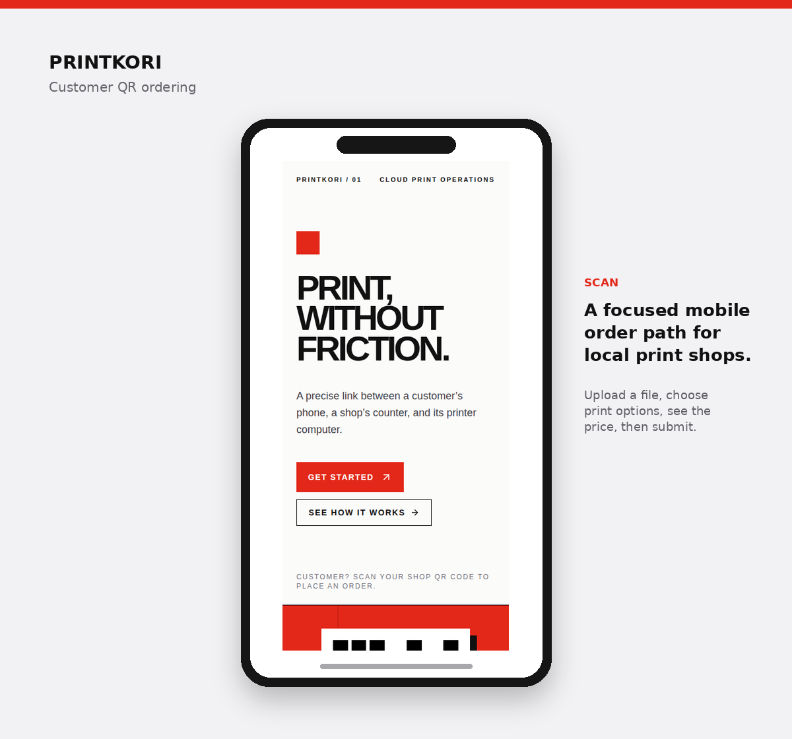
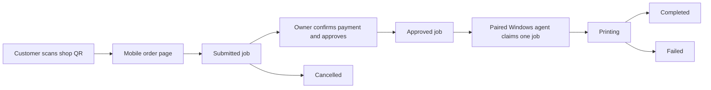

# PrintKori

> **Cloud print operations for practical local print shops.**

PrintKori connects a customer’s phone, a shop owner’s approval desk, and a Windows printer computer in one controlled workflow. Customers order from a QR code, owners confirm each job and cash payment, and the visible PowerShell print agent prints only work that the shop has approved.

**Live application:** [printkori-lwdj5kys.manus.space](https://printkori-lwdj5kys.manus.space/)

## Product Preview





The screenshots are built from the real PrintKori interface rather than fictional product screens. The landing experience uses a red, black, and white operational design system, while motion and progressive reveals remain optional for visitors who prefer reduced motion.

## What PrintKori Solves

Traditional local print shops often take orders through verbal instructions, messaging apps, or an unmanaged shared printer. PrintKori replaces that fragmented handoff with a clearer operating path: the customer submits a structured request, the shop controls approval, and the selected Windows printer receives one approved job at a time.

| Audience | What they use | What they gain |
| --- | --- | --- |
| **Customer** | A mobile-first QR order page | Clear print choices, calculated Tk pricing, printer-availability feedback, and status tracking. |
| **Shop owner** | An authenticated operations dashboard | Shop setup, job approval, QR download, pricing, staff, agent pairing, and history controls. |
| **Printer operator** | A transparent interactive PowerShell agent | Printer discovery, one-time-code pairing, a test page, visible worker status, and controlled startup options. |

## Operating Model



The exact job labels used across the platform are **Submitted**, **Pending**, **Approved**, **Printing**, **Completed**, **Failed**, and **Cancelled**. Active jobs remain protected from deletion; only terminal jobs can be removed from dashboard history through a confirmed, non-destructive archive action.

## Core Capabilities

### Customer QR Ordering

Every configured shop receives a downloadable QR code that opens its branded customer route. Customers upload a document, choose grayscale or colour, copies, paper, and one- or two-sided printing, then review a calculated price before submitting. If no paired printer agent is online, the page explains that printing is unavailable and blocks unexplained submissions.

### Owner Dashboard and Settings

The first-use setup sequence deliberately follows the shop’s real operating order: **shop name**, **logo**, **pricing**, **available paper options**, then **staff accounts**. After setup, the professional settings workspace separates business profile, logo, four core price rules, paper options, staff, and print-agent controls so owners can correct or refine choices without repeating onboarding.

### Controlled Windows Print Agent

`PrintKoriAgent.ps1` is a visible, menu-driven PowerShell companion for Windows printer computers. It can detect printers, pair or re-pair with one-time codes, inspect status, print a Windows test page, start the worker, and configure optional user or system startup. The agent never prints a job until the shop dashboard has marked it **Approved**.

### Reliability Controls

The agent sends heartbeat signals while online and while printing. A production Heartbeat runs every five minutes against the protected stale-job callback, using each shop’s configurable timeout to recover abandoned `Printing` jobs safely. Initial automatic production runs completed successfully with HTTP 200 responses.

## Architecture

| Layer | Implementation | Responsibilities |
| --- | --- | --- |
| **Public client** | React 19, Tailwind CSS 4, Wouter | Landing page, shop QR ordering, and customer job-status views. |
| **Owner workspace** | React 19, tRPC client, Manus OAuth | Setup, settings, jobs, QR generation, pairing controls, and history. |
| **Application server** | Express 4, tRPC 11 | Typed APIs, state transitions, pricing, permissions, agent REST endpoints, and scheduled callback handling. |
| **Data and files** | Drizzle ORM, MySQL, managed S3 | Shop configuration, jobs, agent metadata, events, and secure document/logo storage. |
| **Print endpoint** | Windows PowerShell 5+ | Local printer discovery, pairing, polling, printing, completion, and failure reporting. |

## Repository Layout

```text
client/                 React customer and owner interfaces
  src/pages/            Landing, customer order, job status, dashboard, settings
  src/components/       Dashboard shell and reusable UI components
server/                 tRPC router, domain services, REST agent API, scheduled callback
drizzle/                Database schema and migration history
agent/                  PrintKoriAgent.ps1 and Windows installation guide
docs/images/            README product screenshots
scripts/                Reproducible README mockup generator
```

## Local Development

### Prerequisites

Use Node.js 22+, pnpm, and a MySQL-compatible database. The managed deployment provides the production OAuth, storage, database, and notification configuration; local contributors should supply equivalent environment values before running workflows that depend on them.

### Run the app

```bash
pnpm install
pnpm dev
```

The development server exposes the public landing page, customer shop routes, and the owner dashboard from one application. Use the dashboard sign-in route to begin a shop setup.

### Validate changes

```bash
pnpm check
pnpm test
pnpm build
```

The repository includes automated coverage for core pricing, valid job transitions, agent-claim protection, stale-job handling, OAuth return-path behaviour, navigation helpers, and landing-page content contracts.

## Windows Agent Setup

Download `PrintKoriAgent.ps1` from the shop dashboard and move it to the Windows computer connected to the printer. Open PowerShell, run the script, and use the interactive menu in this order.

| Step | Menu action | Outcome |
| --- | --- | --- |
| 1 | **Detect printers** | Lists Windows printers and lets the operator identify the target device. |
| 2 | **Pair** | Connects the agent with a one-time code created in the dashboard. |
| 5 | **Test page** | Prints the operating system’s test page to validate the selected printer. |
| 6 | **Start worker** | Starts the visible worker that polls for a single approved job. |

The optional startup actions are explicit owner choices. See [`agent/INSTALLATION_GUIDE.md`](agent/INSTALLATION_GUIDE.md) for the complete Windows walkthrough.

## Pricing Rules

PrintKori keeps pricing intentionally compact. A shop configures four core rates, shown and calculated as decimal Bangladesh Taka (`0.00 Tk`). The same rules apply across its enabled paper options.

| Print mode | Single-sided | Double-sided |
| --- | --- | --- |
| **Grayscale** | Configured shop rate | Configured shop rate |
| **Colour** | Configured shop rate | Configured shop rate |

## Production Monitoring

The `printkori-stale-print-jobs` scheduled task calls `POST /api/scheduled/stale-print-jobs` on this UTC schedule:

```text
0 */5 * * * *
```

The callback evaluates only jobs in `Printing`, checks the last agent heartbeat against the shop’s configurable timeout, and transitions stale jobs to `Failed` through the same controlled domain logic used by the application.

## Security and Control Principles

PrintKori is designed around a few non-negotiable operating rules:

1. **No automatic printing before approval.** The agent may only claim approved work.
2. **One job at a time per agent.** Claim rules prevent accidental parallel output from a single printer worker.
3. **One-time pairing codes.** Agent registration is not an open, reusable secret.
4. **Secure file references.** Files live in managed object storage; the database stores metadata and references rather than document bytes.
5. **Visible ownership.** The Windows companion remains understandable and controllable by the shop owner.

## License

This repository is currently private and maintained for the PrintKori project. Add a license before distributing the code publicly.
